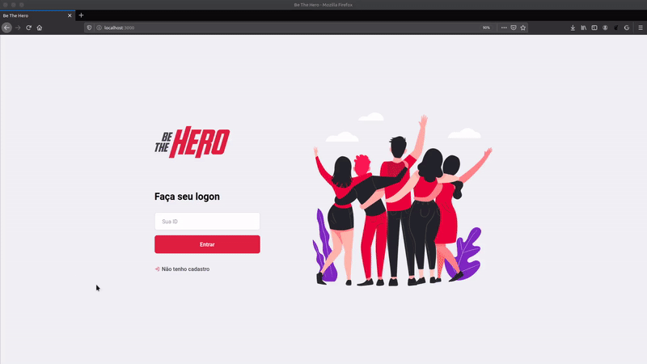
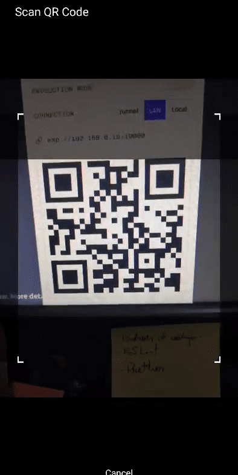

Be The Hero
=============


<h1 align="center">
    <p></p>
</h1>


Ler em [Português](https://github.com/BrunoSilveiraDev/Be-the-hero/tree/master/translation)

A project to help and connect ONGs and people to work together in the various cases. 

_Made at OmniStack Week 11, from [RocketSeat](https://rocketseat.com.br/)._


## :computer: Technologies Used  


[NodeJs](https://nodejs.org/en/)


[React](https://reactjs.org/)


[React Native](https://reactnative.dev/)


[SQLite](https://www.sqlite.org/index.html)


## :rocket: Running the project   
You will need to install [Git](https://git-scm.com/downloads) and [NodeJs in version 12.x](https://nodejs.org/en/download/)

and follow the steps:
```bash
# clone the repository
$ git clone https://github.com/BrunoSilveiraDev/Be-the-hero
$ cd Be-the-hero


# install the dependencies
$ cd backend && npm install && cd ..
$ cd frontend && npm install && cd ..
$ cd mobile && npm install && cd ..


# start the application
$ cd backend && npm start
$ cd frontend && npm start
$ cd mobile && expo start
```

- Access the desktop version in http://localhost:3000 
- Install [Expo](https://play.google.com/store/apps/details?id=host.exp.exponent) in your cell phone and, in the Expo, read the QR Code in http://localhost:19002 in your browser.


## :wrench: :hammer: How to Contribute  
Feel free to give your improvments to this project ! 

1. Fork the repository
2. Create a branch of your feature: `git checkout -b example-feature`
3. Commit your changes: `git commit -m "feature: your message here"`
4. Push your changes: `git push origin example-feature` 


